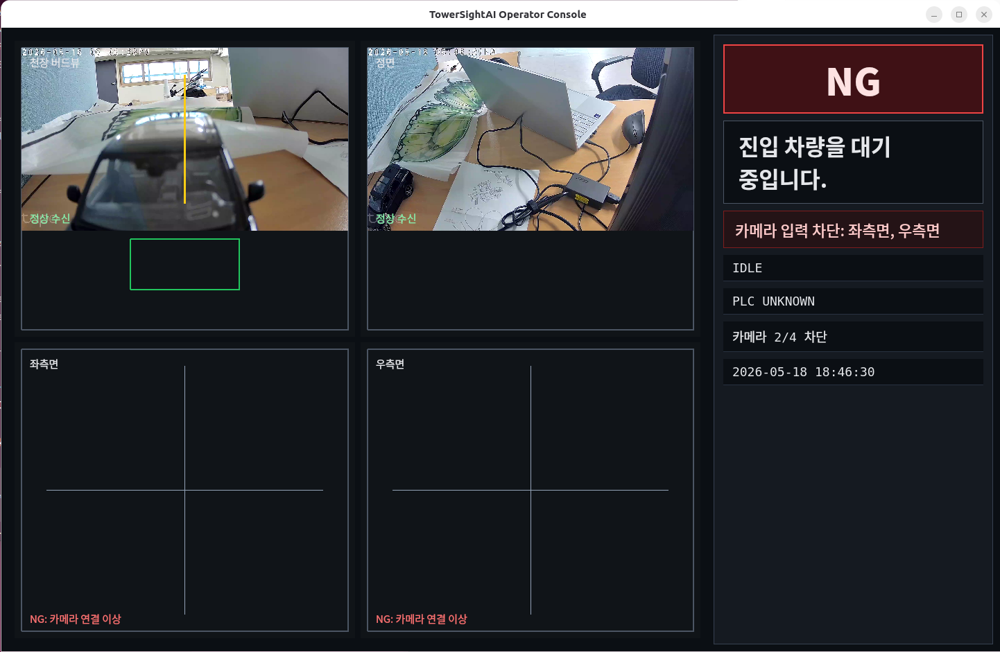

# TowerSightAI

TowerSightAI는 주차기 내부의 4대 카메라와 Hailo 기반 객체 인식을 이용해 차량 진입, 주차 위치 정렬, 사람/장애물 존재 여부를 보수적으로 판단하기 위한 **AI 안전감시 시스템 코어**입니다.

현재 저장소는 전체 제품 중 초기 구현 단계로, 실제 RTSP 카메라 일부를 표시할 수 있는 운전자 UI, 설정 모델, GStreamer/Hailo 파이프라인 문자열 생성, 상태 전이 코어, Fake PLC 어댑터와 단위 테스트를 포함합니다. Hailo-8·PLC 장비 없이도 기본 검증이 가능하도록 하드웨어 의존 영역은 분리되어 있습니다.

> 안전 원칙: 입력이 불확실하거나 누락된 경우에는 OK를 내보내지 않고 NG/대기 상태를 유지해야 합니다. 카메라 프레임 누락, 낮은 신뢰도, 잘못된 캘리브레이션, 알 수 없는 PLC 상태, 사람/장애물 가능성이 있는 경우 모두 최종 OK를 차단하는 방향으로 구현해야 합니다.

## 현재 구현 범위

### 구현된 모듈

| 영역 | 파일 | 현재 기능 |
| --- | --- | --- |
| 설정 모델 | `towersightai/config/settings.py` | 4대 카메라 설정, 카메라 역할 enum, 필수 역할/고유 ID 검증, production 모드 캘리브레이션 파일 존재 검증 |
| 카메라 파이프라인 | `towersightai/camera/pipeline.py` | RTSP URL 비밀번호 마스킹, 저지연 preview/appsink용 GStreamer 파이프라인 문자열 생성 |
| Hailo 추론 파이프라인 | `towersightai/inference/pipeline.py` | 4개 RTSP 입력을 `hailoroundrobin -> hailonet -> hailofilter -> hailopython -> hailostreamrouter`로 연결하는 멀티스트림 파이프라인 문자열 생성 |
| 상태 머신 | `towersightai/state_machine/core.py` | 설계 문서의 공개 상태 정의와 허용된 전이만 통과시키는 `SafetyStateMachine` 구현 |
| PLC 어댑터 | `towersightai/plc/adapter.py` | 실제 PLC 프로토콜 확정 전 테스트용 `FakePLCAdapter` 제공 |
| 운전자 UI | `towersightai/ui/`, `towersightai/cli/operator_ui.py` | PyQt6 기반 2x2 카메라 화면, RTSP 프레임 표시, 카메라 NG/정상 상태 표시, 보수적 최종 OK 차단 UI |
| UI 검증 도구 | `tools/verify_operator_ui_screenshot.sh` | operator UI 실행, 화면 캡처, ImageMagick 메타데이터 확인을 한 번에 수행 |
| 테스트 | `tests/` | 설정 검증, RTSP 마스킹, Hailo 파이프라인 요소 포함 여부, 정상/불법 상태 전이, UI 모델 안전 게이트 테스트 |

### 아직 구현되지 않은 주요 기능

현재 코드는 제품 골격과 안전 게이트의 기초만 포함합니다. 다음 기능은 아직 실제 동작 구현이 아닙니다.

- 실제 Hailo `hailopython` callback과 detection event 정규화
- 차량/번호판/정렬/사람/장애물/차내 탑승자 AI 판정 로직
- 실제 PLC 통신 어댑터
- 설정 화면, 캘리브레이션 도구
- Ubuntu/Hailo 장비용 하드웨어 smoke test 스크립트


## 실제 설정 확인 CLI

로컬 장비 또는 Ubuntu/Hailo 타깃에서 실제 `.env`를 읽어 설정, 카메라, Hailo 설치 상태를 점검할 수 있습니다. 이 명령은 **점검 전용**이며 PLC OK 신호를 승인하지 않습니다. 실패하거나 불확실한 항목은 NG로 표시합니다.

```bash
# .env 구조와 카메라 설정을 마스킹된 값으로 확인
python -m towersightai.cli.check_settings --env .env

# 정상 설정된 카메라의 GStreamer 프리뷰 창 실행
python -m towersightai.cli.check_settings --env .env --preview-cameras

# 안정적인 LAN에서 RTSP UDP 전송으로 preview 지연을 비교
python -m towersightai.cli.check_settings --env .env --preview-cameras --rtsp-transport udp

# 정상 설정된 카메라별 1프레임 수신 health check
python -m towersightai.cli.check_settings --env .env --health-check-cameras

# HailoRT, Hailo GStreamer 요소, HEF/postprocess 경로 확인
python -m towersightai.cli.check_settings --env .env --check-hailo

# 프리뷰 대상만 마스킹하여 확인하고 실제 창은 띄우지 않음
python -m towersightai.cli.check_settings --env .env --preview-cameras --dry-run
```

카메라 설정 확인은 부분 설정을 허용합니다. 예를 들어 4대 중 1대만 `CAMERA_N_ID`, `CAMERA_N_ROLE`, `CAMERA_N_RTSP_URL`이 채워져 있어도 해당 카메라만 프리뷰/health check 대상으로 선택할 수 있습니다. 반면 제품 런타임용 `Settings` 검증은 기존처럼 4대 카메라와 필수 역할이 모두 유효해야 통과합니다.

## 운전자 UI 실행

operator UI는 `.env`를 읽어 4개 카메라 타일을 구성하고, 연결 가능한 RTSP 카메라는 실제 프레임을 표시합니다. 연결되지 않거나 프레임이 지연되는 카메라는 NG 상태로 유지됩니다. PLC, Hailo, 캘리브레이션이 확인되지 않은 상태에서는 카메라가 수신되어도 최종 OK를 표시하지 않습니다.

```bash
# venv 사용 권장
source .venv/bin/activate
towersightai-operator-ui --env .env --windowed

# 또는 모듈 직접 실행
.venv/bin/python -m towersightai.cli.operator_ui --env .env --windowed
```

UI 런타임에는 `PyQt6`와 `opencv-python`이 필요합니다. OpenCV가 GStreamer backend 없이 빌드된 환경에서도 FFmpeg RTSP fallback으로 프레임 표시를 시도합니다. GStreamer backend가 있는 환경에서는 `towersightai.camera.pipeline.build_preview_pipeline()`이 생성한 low-latency appsink pipeline을 우선 사용합니다.

현재 검증된 동작:

- `.env`의 `ceiling`, `front` 카메라 2대가 연결 가능한 경우 상단 2개 타일에 영상 표시
- `rear_side`, `opposite_side` 등 미연결 카메라는 `NG: 카메라 연결 이상` 표시
- 오른쪽 상태 패널은 런타임 카메라 상태를 반영해 `카메라 2/4 차단`처럼 표시
- RTSP 초기 연결 실패 또는 프레임 지연 시 worker가 종료되지 않고 재연결 시도



위 캡처는 `.venv` 환경에서 `towersightai-operator-ui --env .env --windowed` 실행 후 실제 화면을 검증한 결과입니다. 상단의 `천장 버드뷰`, `정면` 카메라는 RTSP 프레임을 정상 수신하고, 하단의 좌측면/우측면 카메라는 연결 이상으로 NG 표시됩니다. 상태 패널은 현재 카메라 상태를 `카메라 2/4 차단`으로 요약하며, PLC/Hailo/캘리브레이션이 확인되지 않았기 때문에 전체 안전 상태는 계속 `NG`로 유지됩니다.

## 화면 캡처 기반 UI 검증

Ubuntu 데스크톱 세션에서 `gnome-screenshot`, `xdotool`, `imagemagick`을 설치하면 실제 화면 검증 루프를 실행할 수 있습니다.

```bash
sudo apt update
sudo apt install -y gnome-screenshot xdotool imagemagick
WAIT_SECONDS=15 tools/verify_operator_ui_screenshot.sh .env tmp/operator-ui-verification
```

검증 스크립트는 다음을 수행합니다.

- `PyQt6`와 `cv2`를 모두 import할 수 있는 Python runtime 선택
- operator UI를 windowed mode로 실행
- 창이 뜬 뒤 `gnome-screenshot`으로 전체 화면 캡처
- `identify`로 PNG 메타데이터 확인
- 앱 종료

생성된 스크린샷은 `tmp/operator-ui-verification/` 아래에 저장됩니다. 이 경로는 로컬 검증 산출물이므로 커밋하지 않습니다.

## 프로젝트 구조

```text
TowerSightAI/
├── .env.example                         # 배포 환경 변수 예시(placeholder만 사용)
├── docs/                                # 시스템 설계 및 구현 가이드
├── refers/                              # Hailo/GStreamer 참고 실험 코드(기본적으로 수정 금지)
├── tests/                               # 하드웨어 없이 실행되는 단위 테스트
└── towersightai/
    ├── camera/                          # RTSP/GStreamer preview 파이프라인 유틸
    ├── config/                          # typed 설정 모델과 안전 검증
    ├── inference/                       # Hailo 멀티스트림 파이프라인 빌더
    ├── plc/                             # PLC 어댑터 인터페이스의 초기 fake 구현
    ├── state_machine/                   # 주차기 AI 안전 상태 머신
    └── ui/                              # PyQt6 operator display model and app
```

## 요구 사항

### 로컬 개발/테스트

- Python 3.11 이상
- `pip`
- 테스트용 의존성: `pytest`
- UI 의존성: `PyQt6`, `opencv-python`

`pyproject.toml`의 런타임 의존성은 현재 `pydantic`, `pydantic-settings`를 선언하지만, 현 코드의 `Settings`는 아직 dataclass 기반 수동 생성 방식입니다.

### 실제 장비 연동 시 예정 요구 사항

다음은 현재 단위 테스트에는 필요하지 않지만, Hailo/카메라 연동 단계에서 필요한 런타임 구성입니다.

- Ubuntu 대상 머신
- Hailo-8 M.2 및 호환 HailoRT/TAPPAS 설치
- GStreamer 및 Hailo 플러그인(`hailonet`, `hailofilter`, `hailopython`, `hailoroundrobin`, `hailostreamrouter` 등)
- 4대 RTSP 카메라(Tapo-C310 기준)
- PLC 또는 PLC simulator

## 설치 방법

```bash
cd /workspace/TowerSightAI
python -m venv .venv
source .venv/bin/activate
python -m pip install --upgrade pip
python -m pip install -e ".[ui]" pytest
```

## 환경 설정

1. 예시 파일을 복사합니다.

   ```bash
   cp .env.example .env
   ```

2. `.env`에 사이트별 값을 입력합니다.

   - `CAMERA_1_*` ~ `CAMERA_4_*`: 4대 카메라 ID, 역할, RTSP URL, 계정 정보
   - `HAILO_HEF_PATH`: Hailo HEF 파일 경로
   - `HAILO_POSTPROCESS_SO`: Hailo postprocess `.so` 경로
   - `CALIBRATION_PATH`: 캘리브레이션 JSON 경로
   - `PLC_ENDPOINT`: PLC 또는 simulator endpoint
   - `UI_CAMERA_RESOLUTION`: 운전자 표시/preview 카메라 해상도. `WIDTHxHEIGHT` 형식이며 기본값은 `1280x720`입니다.

3. 실제 비밀번호, 실제 RTSP URL, PLC secret, 로컬 Hailo 설치 경로는 커밋하지 마세요. `.env.example`에는 placeholder만 유지해야 합니다.

> 참고: CLI는 `--env .env`로 `.env`를 직접 읽습니다. 테스트나 라이브러리 코드에서는 `Settings(...)`를 직접 생성하거나 `load_settings_from_env()`를 사용할 수 있습니다.

## 사용 예시

### 1. 설정 객체 생성 및 안전 검증

```python
from pathlib import Path

from towersightai.config.settings import Settings

settings = Settings(
    app_env="development",
    tappas_workspace=Path("/opt/hailo/tappas"),
    hailo_hef_path=Path("/opt/hailo/tappas/apps/h8/gstreamer/resources/hef/yolov5m_wo_spp_60p.hef"),
    hailo_postprocess_so=Path("/opt/hailo/tappas/apps/h8/gstreamer/libs/post_processes/libyolo_hailortpp_post.so"),
    camera_1={"id": "ceiling", "role": "ceiling", "rtsp_url": "rtsp://192.0.2.10:554/stream1"},
    camera_2={"id": "front", "role": "front", "rtsp_url": "rtsp://192.0.2.11:554/stream1"},
    camera_3={"id": "rear_side", "role": "rear_side", "rtsp_url": "rtsp://192.0.2.12:554/stream1"},
    camera_4={"id": "opposite_side", "role": "opposite_side", "rtsp_url": "rtsp://192.0.2.13:554/stream1"},
    calibration_path=Path("data/calibration/site.json"),
    plc_endpoint="tcp://127.0.0.1:502",
)

print([camera.id for camera in settings.cameras])
```

검증 규칙:

- 카메라 ID 4개는 모두 고유해야 합니다.
- `ceiling`, `front`, `rear_side`, `opposite_side` 역할이 모두 정확히 한 번씩 있어야 합니다.
- `app_env="production"`에서는 `calibration_path` 파일이 실제로 존재해야 합니다.

### 2. RTSP URL 마스킹 및 preview 파이프라인 생성

```python
from towersightai.camera.pipeline import build_preview_pipeline, redact_rtsp

camera = settings.camera_2
pipeline = build_preview_pipeline(camera, latency_ms=100)

print(redact_rtsp(camera.rtsp_url))
print(pipeline)
```

`build_preview_pipeline()`은 다음 형태의 preview/appsink 파이프라인 문자열을 만듭니다.

```text
rtspsrc location=<rtsp-url> latency=<ms> protocols=tcp drop-on-latency=true ! rtph264depay ! h264parse ! decodebin ! queue max-size-buffers=1 max-size-bytes=0 max-size-time=0 leaky=downstream ! videoscale ! video/x-raw,width=1280,height=720 ! videoconvert ! video/x-raw,format=RGB ! appsink sync=false drop=true max-buffers=1
```

Tapo-C310은 카메라 사양상 15fps 장비이므로 preview FPS가 약 15로 보이면 정상 상한일 수 있습니다. 이 경우 목표는 FPS를 30으로 올리는 것이 아니라 프레임 적체 없이 최신 프레임을 안정적으로 표시하는 것입니다.

### 3. Hailo 멀티스트림 파이프라인 생성

```python
from towersightai.inference.pipeline import build_multistream_hailo_pipeline

pipeline = build_multistream_hailo_pipeline(settings)
print(pipeline)
```

현재 빌더는 4개 RTSP 입력을 모델 입력 크기 형식으로 변환한 뒤 다음 Hailo 요소를 포함하는 문자열을 생성합니다.

```text
hailoroundrobin -> hailonet -> hailofilter -> hailopython -> hailostreamrouter
```

생성된 문자열은 현재 테스트 가능한 파이프라인 형태를 표현하기 위한 빌더 결과입니다. 실제 장비 실행 전에는 Hailo/TAPPAS 설치 상태, HEF/postprocess 호환성, camera-to-router 매핑, callback 모듈 구현 여부를 반드시 검증해야 합니다.

### 4. 상태 머신 사용

```python
from towersightai.state_machine.core import ParkingState, SafetyStateMachine

sm = SafetyStateMachine()
sm.transition(ParkingState.VEHICLE_DETECTED)
sm.transition(ParkingState.PLATE_RECOGNITION)
sm.transition(ParkingState.VEHICLE_ENTERING)
sm.transition(ParkingState.ALIGNMENT_GUIDE)
sm.transition(ParkingState.PARKED)
sm.transition(ParkingState.SAFETY_CHECK)
sm.transition(ParkingState.READY_FOR_OPERATION)
sm.transition(ParkingState.AI_STOP)

print(sm.current_state)
```

정의된 상태 흐름은 다음과 같습니다.

```text
IDLE
-> VEHICLE_DETECTED
-> PLATE_RECOGNITION
-> VEHICLE_ENTERING
-> ALIGNMENT_GUIDE
-> PARKED
-> SAFETY_CHECK
-> READY_FOR_OPERATION
-> AI_STOP
```

`SAFETY_CHECK`에서 사람이 감지되면 `HUMAN_DETECTED`로 이동할 수 있고, 이후 다시 `SAFETY_CHECK`로 돌아와 재확인할 수 있습니다. 허용되지 않은 전이는 `ValueError`를 발생시킵니다.

### 5. Fake PLC 어댑터 사용

```python
from towersightai.plc.adapter import FakePLCAdapter

plc = FakePLCAdapter()
plc.send("vehicle_parked")
plc.send("safety_status_ng")

assert plc.events == ["vehicle_parked", "safety_status_ng"]
```

현재 `FakePLCAdapter`는 이벤트 순서를 테스트하기 위한 단순 기록기입니다. 실제 PLC 프로토콜은 확정 후 별도 어댑터로 추가해야 합니다.

## 테스트 실행

```bash
pytest
```

현재 테스트는 실제 RTSP 카메라, Hailo-8, PLC 없이 실행되도록 설계되어 있습니다.

테스트 범위:

- 카메라 ID 중복 검증
- production 모드 캘리브레이션 파일 필수 검증
- RTSP URL credential 마스킹
- Hailo 멀티스트림 파이프라인 필수 요소 포함 검증
- 정상 상태 전이와 불법 상태 전이 검증
- UI 카메라 레이아웃, 한국어 안내 문구, credential redaction, 최종 OK 안전 게이트 검증

## 개발 시 주의사항

- 불확실한 입력은 항상 OK가 아니라 NG/대기/오류로 처리하세요.
- 실제 camera credential, RTSP password, PLC secret, `.env` 파일을 커밋하지 마세요.
- `refers/`는 하드웨어 실험 참고용입니다. 명시 요청이 없으면 수정하지 마세요.
- 하드웨어 의존 코드는 interface 뒤에 두고, 기본 테스트는 장비 없이 실행 가능해야 합니다.
- PLC OK/NG에 영향을 주는 모든 상태 전이는 성공, 실패, 불확실성 케이스 테스트를 추가해야 합니다.

## 구현 로드맵 기준 현재 위치

현재 저장소는 `docs/implementation/implementation-roadmap.md` 기준으로 다음 단계에 있습니다.

- Phase 1(Project Skeleton): 일부 구현됨
  - 설정 모델, `.env.example`, Fake PLC, 기본 테스트가 존재합니다.
- Phase 2(Camera Ingest): 초기 일부 구현됨
  - preview pipeline 문자열 빌더, RTSP 마스킹, UI용 RTSP 프레임 표시와 재연결 로직이 존재합니다.
- Phase 3(Hailo Inference): 초기 일부 구현됨
  - 멀티스트림 Hailo pipeline 문자열 빌더만 존재합니다.
- Phase 4 이후(State Machine/PLC/UI/AI logic/Field hardening): 상태 머신의 기본 전이와 operator display model은 구현되어 있고, 실제 AI 판정/PLC 프로토콜/캘리브레이션 UI 연동은 후속 작업입니다.

## 예시 이미지 Hailo 디텍션 검증

실제 Hailo-8/TAPPAS가 설치된 Ubuntu 타깃에서는 RTSP 카메라 연결 전에도, 안전하게 준비한 예시 이미지 1장을 Hailo 파이프라인에 통과시켜 callback과 detection 정규화가 동작하는지 확인할 수 있습니다. 이 명령은 검증 전용이며 PLC OK를 절대 승인하지 않습니다.

```bash
# 먼저 실행될 GStreamer 파이프라인만 확인합니다. 실제 Hailo는 실행하지 않습니다.
towersightai-hailo-image-smoke --env .env --image data/samples/sanitized-car.jpg

# Hailo 설치 상태까지 같이 확인합니다.
towersightai-hailo-image-smoke --env .env --image data/samples/sanitized-car.jpg --check-installation

# Ubuntu/Hailo 타깃에서 실제 실행합니다. 하드웨어 smoke는 명시적 opt-in이 필요합니다.
RUN_HARDWARE_TESTS=1 towersightai-hailo-image-smoke \
  --env .env \
  --image data/samples/sanitized-car.jpg \
  --run \
  --event-path artifacts/hailo/sample-detections.jsonl \
  --output-image artifacts/hailo/sample-detection.png
```

검증 파이프라인은 다음 순서로 구성됩니다.

```text
sample image -> decode/scale/convert RGB 640x640 -> hailonet -> hailofilter -> hailopython -> hailooverlay -> PNG/display/fakesink
```

`hailopython` callback은 Hailo raw detection을 `camera_id`, `label`, `confidence`, normalized `bbox`, `timestamp`, `source="hailo"` 형태의 JSONL 이벤트로 저장합니다. 이벤트가 없거나 신뢰도가 낮은 경우는 안전 판단에서 OK가 아니라 NG/대기 상태로 취급해야 합니다.
