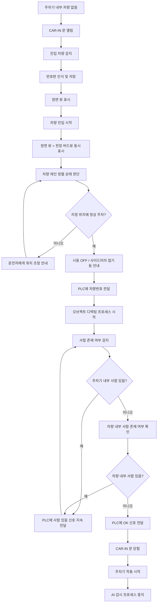

# 주차기 내부 AI 안전감시 시스템 설계안

## 1. 프로젝트 개요

본 시스템은 자동차 주차기 내부에 설치된 4대의 카메라를 이용하여 차량 진입, 번호판 인식, 주차 위치 정렬, 사람 존재 여부, 차량 내부 탑승자 존재 여부, 안전 상태 판단을 AI로 수행하는 주차기 내부 안전감시 시스템이다.

AI는 차량이 주차기 내부로 진입하는 순간부터 지정 위치에 정차하고, 내부에 사람이 없는 안전 상태가 확인될 때까지 동작한다. 이후 PLC와 통신하여 차량번호, 사람 존재 여부, 최종 OK 신호 등을 전달한다.

CAR-IN 문이 닫히고 주차기가 실제로 작동되기 시작하면 AI 감시 프로세스는 중지된다.

---

## 2. 카메라 구성

본 시스템은 총 4대의 카메라로 주차기 내부를 지속적으로 촬영한다.

| 구분 | 설치 위치 | 주요 목적 |
|---|---|---|
| 카메라 1 | 천장 중앙 또는 상부 | 버드뷰 확보, 차량 위치 및 정렬 상태 판단 |
| 카메라 2 | CAR-IN 정면 약 3m 높이 | 진입 차량 감지, 번호판 인식, 정면 뷰 제공 |
| 카메라 3 | 차량 뒤쪽 및 한쪽 사이드가 보이는 구석 약 3m 높이 | 후방 및 측면 감시, 사람/장애물 감지 |
| 카메라 4 | 반대쪽 사이드 방향 | 반대편 측면 감시, 사람/장애물 감지 |

---

## 3. 전체 동작 흐름



---

## 4. 단계별 프로세스

### 4.1 대기 상태

#### 조건

- 주차기 내부에 차량이 없음
- CAR-IN 방향 문이 열려 있음
- 주차기 내부 AI 감시 시스템이 대기 상태로 동작 중

#### 수행 기능

- 정면 카메라를 중심으로 진입 차량 감시
- 주차기 내부의 빈 상태 확인
- 외부에서 진입하려는 차량 탐지 준비

### 4.2 진입 차량 감지 및 번호판 인식

#### 트리거 조건

- CAR-IN 문이 열린 상태
- 차량이 주차기 입구 방향으로 접근
- 정면 카메라에서 차량 전면부 또는 번호판 영역 감지

#### 수행 기능

1. 진입 차량 감지
2. 번호판 영역 검출
3. OCR 기반 번호판 인식
4. 인식된 차량번호 임시 저장
5. 화면에 정면 뷰 표시

#### 저장 정보 예시

```json
{
  "vehicle_detected": true,
  "plate_number": "12가3456",
  "entry_time": "2026-04-29T11:30:00+09:00",
  "source_camera": "front_camera",
  "confidence": 0.94
}
```

### 4.3 차량 진입 및 정렬 판단

#### 트리거 조건

- 차량이 주차기 내부로 일정 거리 이상 진입
- 정면 카메라와 천장 버드뷰 카메라에서 차량이 동시에 확인됨

#### 화면 표시

- 정면 뷰
- 천장 버드뷰
- 차량 위치 가이드라인
- 레인 중앙선 또는 기준선
- 차량 정렬 상태 표시

#### 수행 기능

1. 차량의 현재 위치 추정
2. 차량의 진행 방향 추정
3. 차량이 레인 중앙에 맞게 진입 중인지 판단
4. 차량이 좌우로 치우쳤는지 판단
5. 차량이 지정 정차 위치에 도달했는지 판단
6. 운전자에게 안내 메시지 표시

#### 안내 메시지 예시

| 상태 | 안내 메시지 |
|---|---|
| 차량이 왼쪽으로 치우침 | 차량을 오른쪽으로 조금 이동해 주세요. |
| 차량이 오른쪽으로 치우침 | 차량을 왼쪽으로 조금 이동해 주세요. |
| 차량이 더 진입해야 함 | 조금 더 앞으로 진입해 주세요. |
| 차량이 너무 많이 진입함 | 차량을 조금 후진해 주세요. |
| 정상 위치 도달 | 정상 위치에 주차되었습니다. |

### 4.4 정상 주차 완료 판단

#### 조건

- 차량이 지정된 주차 위치 안에 있음
- 차량의 좌우 정렬 상태가 기준 범위 내에 있음
- 차량의 전후 위치가 기준 범위 내에 있음
- 차량이 정지 상태임

#### 수행 기능

1. 차량 정차 상태 확인
2. 지정 위치 주차 완료 판정
3. 운전자에게 후속 안내 메시지 출력
4. PLC에 차량번호 전달

#### 안내 메시지 예시

- 정상 위치에 주차되었습니다.
- 시동을 꺼 주세요.
- 사이드미러를 접어 주세요.
- 차량 내부와 주차기 내부를 확인해 주세요.
- 문이 닫히기 전 주차기 내부에 사람이 없는지 확인 중입니다.

#### PLC 전달 정보 예시

```json
{
  "event": "vehicle_parked",
  "plate_number": "12가3456",
  "parking_position_status": "OK",
  "timestamp": "2026-04-29T11:32:00+09:00"
}
```

### 4.5 오브젝트 디텍팅 프로세스

차량이 정상 위치에 주차되고 차량번호가 PLC로 전달된 이후, 시스템은 오브젝트 디텍팅 프로세스로 전환된다.

이 단계의 핵심 목적은 주차기 내부와 차량 내부에 사람이 남아 있는지 확인하는 것이다.

#### 감지 대상

| 대상 | 목적 |
|---|---|
| 사람 | 주차기 내부에 사람이 있는지 감지 |
| 차량 내부 탑승자 | 차량 안에 사람이 남아 있는지 감지 |
| 장애물 | 주차기 작동 전 위험 요소 확인 |
| 차량 | 차량만 존재하는 정상 상태 확인 |

### 4.6 주차기 내부 사람 감지

#### 조건

- CAR-IN 문이 아직 열려 있음
- 차량은 지정 위치에 정차되어 있음
- 사람이 주차기 내부에 남아 있을 가능성이 있음

#### 수행 기능

1. 4대 카메라 전체에서 사람 탐지
2. 사람의 위치 추정
3. 사람이 주차기 내부에 있는지 판단
4. 사람이 감지되는 동안 PLC에 사람 있음 신호 지속 전달

#### PLC 전달 예시

```json
{
  "event": "human_detected",
  "human_present": true,
  "location": "inside_parking_machine",
  "timestamp": "2026-04-29T11:33:00+09:00"
}
```

#### 시스템 동작

사람이 계속 감지되는 경우:

- AI 감시 지속
- PLC에 사람 있음 상태 지속 전달
- OK 신호 미전달
- CAR-IN 문 닫힘 또는 주차기 작동 허용 금지

### 4.7 차량 내부 사람 존재 여부 확인

주차기 내부에 사람이 감지되지 않더라도, 차량 내부에 탑승자가 남아 있는지 추가로 확인해야 한다.

#### 목적

- 운전자 또는 동승자가 차량 내부에 남아 있는 상황 방지
- 어린이, 반려동물, 탑승자 잔류 위험 감지
- 주차기 작동 전 최종 안전 확인

#### 수행 기능

1. 정면 카메라 및 사이드 카메라를 이용한 차량 내부 영역 분석
2. 유리창, 앞좌석, 뒷좌석 영역 내 사람 존재 여부 추정
3. 차량 내부 사람 존재 가능성이 있으면 PLC에 위험 상태 전달
4. 차량 내부에 사람이 없다고 판단되면 다음 단계로 진행

#### 판단 결과 예시

```json
{
  "event": "in_vehicle_occupancy_check",
  "person_inside_vehicle": false,
  "confidence": 0.89,
  "timestamp": "2026-04-29T11:34:00+09:00"
}
```

### 4.8 최종 OK 신호 전달

#### OK 조건

다음 조건이 모두 만족되어야 PLC에 OK 신호를 전달한다.

- 차량이 지정 위치에 정상 주차됨
- 차량번호 인식 및 저장 완료
- PLC에 차량번호 전달 완료
- 주차기 내부에 사람이 없음
- 차량 내부에 사람이 없음
- 위험 장애물이 감지되지 않음
- CAR-IN 문이 아직 열린 상태이며 최종 안전 확인 완료

#### PLC 전달 예시

```json
{
  "event": "safety_check_complete",
  "safety_status": "OK",
  "vehicle_only": true,
  "human_present": false,
  "person_inside_vehicle": false,
  "plate_number": "12가3456",
  "timestamp": "2026-04-29T11:35:00+09:00"
}
```

### 4.9 CAR-IN 문 닫힘 및 AI 프로세스 중지

#### 조건

- PLC가 OK 신호를 수신
- CAR-IN 문 닫힘
- 주차기 작동 시작

#### 수행 기능

- AI 감시 프로세스 중지
- 카메라 영상 분석 중지 또는 대기 모드 전환
- 주차기 작동 중에는 AI 판단 로직 비활성화
- 다음 차량 입고를 위한 초기 대기 상태로 전환 준비

---

## 5. 상태 정의

| 상태 코드 | 상태명 | 설명 |
|---|---|---|
| IDLE | 대기 | 차량 없음, CAR-IN 문 열림 대기 |
| VEHICLE_DETECTED | 차량 감지 | 진입 차량 감지 |
| PLATE_RECOGNITION | 번호판 인식 | 번호판 OCR 수행 |
| VEHICLE_ENTERING | 차량 진입 중 | 차량이 주차기 내부로 진입 중 |
| ALIGNMENT_GUIDE | 정렬 안내 | 차량 위치 및 레인 정렬 판단 |
| PARKED | 주차 완료 | 지정 위치 정상 주차 |
| SAFETY_CHECK | 안전 확인 | 사람 및 장애물 감지 |
| HUMAN_DETECTED | 사람 감지 | 내부 또는 차량 내 사람 감지 |
| READY_FOR_OPERATION | 작동 준비 완료 | 차량만 존재, 사람 없음 |
| AI_STOP | AI 중지 | CAR-IN 문 닫힘 및 주차기 작동 시작 |

---

## 6. 주요 AI 기능

### 6.1 차량 감지

- 차량 진입 여부 판단
- 차량 위치 추적
- 차량 정지 여부 판단
- 차량 크기 및 방향 추정

### 6.2 번호판 인식

- 번호판 영역 탐지
- 번호판 OCR
- 인식 정확도 confidence 산출
- 차량번호 저장 및 PLC 전달

### 6.3 차량 위치 및 정렬 판단

- 버드뷰 기반 차량 위치 추정
- 정면 카메라 기반 진입 방향 판단
- 레인 기준선 대비 좌우 치우침 판단
- 전후 위치 판단
- 지정 위치 도달 여부 판단

### 6.4 사람 감지

- 주차기 내부 사람 감지
- 차량 주변 사람 감지
- 차량 뒤쪽, 측면 사각지대 사람 감지
- 사람이 감지되는 동안 PLC에 위험 상태 지속 전달

### 6.5 차량 내부 탑승자 감지

- 차량 창문 영역 분석
- 앞좌석, 뒷좌석 사람 존재 여부 판단
- 운전자 또는 동승자 잔류 가능성 판단
- 사람이 없을 때만 최종 OK 신호 허용

---

## 7. PLC 통신 항목

| 구분 | 전달 데이터 | 설명 |
|---|---|---|
| 차량번호 | `plate_number` | 인식된 번호판 정보 |
| 차량 주차 완료 | `vehicle_parked` | 차량이 지정 위치에 정상 주차됨 |
| 사람 있음 | `human_present` | 주차기 내부 또는 차량 내부 사람 감지 |
| 사람 없음 | `human_present: false` | 사람 감지되지 않음 |
| 차량 내부 사람 있음 | `person_inside_vehicle: true` | 차량 내부 탑승자 존재 가능 |
| 최종 OK | `safety_status: OK` | 주차기 작동 가능 상태 |
| 위험 상태 | `safety_status: NG` | 주차기 작동 불가 상태 |

---

## 8. 화면 표시 구성

### 8.1 차량 진입 전

- 정면 카메라 뷰 표시
- 차량 감지 대기
- 번호판 인식 대기

### 8.2 차량 진입 중

- 정면 뷰 표시
- 천장 버드뷰 동시 표시
- 차량 위치 가이드라인 표시
- 좌우 정렬 상태 표시
- 전후 이동 안내 표시

### 8.3 주차 완료 후

- 안전 확인 화면 표시
- 주차기 내부 사람 감지 상태 표시
- 차량 내부 사람 감지 상태 표시
- 최종 OK 또는 위험 상태 표시

---

## 9. 예외 상황 처리

| 상황 | 처리 방식 |
|---|---|
| 번호판 인식 실패 | 재인식 시도, 수동 입력 또는 관리자 확인 요청 |
| 차량이 기준 위치를 벗어남 | 운전자에게 위치 조정 안내 |
| 주차기 내부 사람 감지 | PLC에 사람 있음 신호 지속 전달 |
| 차량 내부 사람 감지 | OK 신호 차단, 경고 안내 |
| 카메라 영상 끊김 | 시스템 오류 상태 전환, PLC에 NG 전달 |
| AI 판단 confidence 낮음 | 보수적으로 NG 처리 |
| CAR-IN 문 닫힘 | AI 프로세스 중지 |
| 주차기 작동 시작 | AI 판단 로직 비활성화 |

---

## 10. 핵심 안전 원칙

본 시스템은 안전을 최우선으로 하며, AI 판단이 불확실한 경우에는 항상 보수적으로 동작한다.

다음과 같은 경우에는 PLC에 OK 신호를 전달하지 않는다.

- 사람이 있을 가능성이 있는 경우
- 차량 내부에 사람이 있을 가능성이 있는 경우
- 번호판 인식이 불완전한 경우
- 차량 위치가 기준 범위를 벗어난 경우
- 카메라 영상이 끊긴 경우
- AI confidence가 기준값보다 낮은 경우
- 장애물이 감지된 경우

---

## 11. 최종 목표

1. 차량 진입 단계에서 번호판을 자동 인식한다.
2. 차량이 주차기 내부 레인에 맞게 들어오는지 실시간으로 안내한다.
3. 차량이 지정 위치에 정확히 주차되었는지 판단한다.
4. 운전자에게 시동 OFF, 사이드미러 접기 등의 안내를 제공한다.
5. PLC에 차량번호를 전달한다.
6. 주차기 내부에 사람이 없는지 확인한다.
7. 차량 내부에 사람이 남아 있지 않은지 확인한다.
8. 차량만 존재하는 안전 상태일 때만 PLC에 OK 신호를 전달한다.
9. CAR-IN 문이 닫히고 주차기 작동이 시작되면 AI 프로세스를 중지한다.

---

## 12. 한 줄 요약

4대의 카메라를 이용해 차량 진입, 번호판 인식, 주차 위치 정렬, 사람 및 차량 내부 탑승자 감지를 수행하고, 안전이 확인된 경우에만 PLC에 OK 신호를 전달하는 주차기 내부 AI 안전감시 시스템이다.
